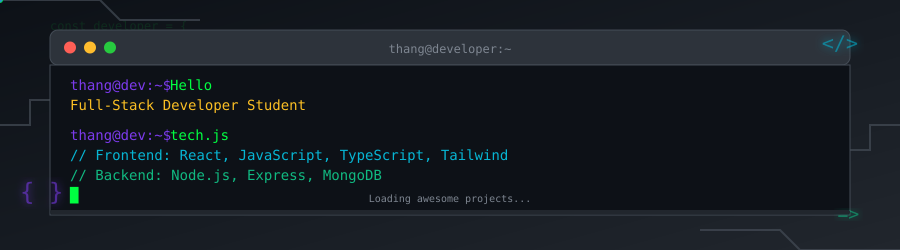

#  Thang Huynh Duc

## Let's Connect!

<!-- https://icons8.com -->

  
  
  
  
  

## About Me

I am a final-year Software Engineering student at the **Academy of Cryptography Techniques (KMA)**, with a strong focus on full-stack web development using the MERN stack. I build backend systems that care about performance, security, and scale — not just getting things to work.

**Location:** Ho Chi Minh City, Vietnam 🇻🇳  
**Status:** Actively seeking internship opportunities to grow and contribute

## My Tech Stack

 
   &nbsp; 
   &nbsp; 
   &nbsp; 
   &nbsp; 
   &nbsp; 
   &nbsp; 
   &nbsp; 
   &nbsp; 
  

   &nbsp; 
   &nbsp; 
   &nbsp; 
   &nbsp; 
   &nbsp; 
   &nbsp; 
   &nbsp; 
   &nbsp; 
   &nbsp; 
   &nbsp; 
   

## Github Stats

  
  

---

> _"Code is poetry written in logic"_

I'm always excited to collaborate on interesting projects, discuss new technologies, or simply chat about the ever-evolving world of web development. Whether you're looking for a passionate intern or want to share knowledge, let's build something amazing together!

**📩 Drop me a line:** [thang.huynhduc.work@gmail.com](mailto:thang.huynhduc.work@gmail.com)

---

_Made with ❤️ and lots of ☕ in Ho Chi Minh City_

