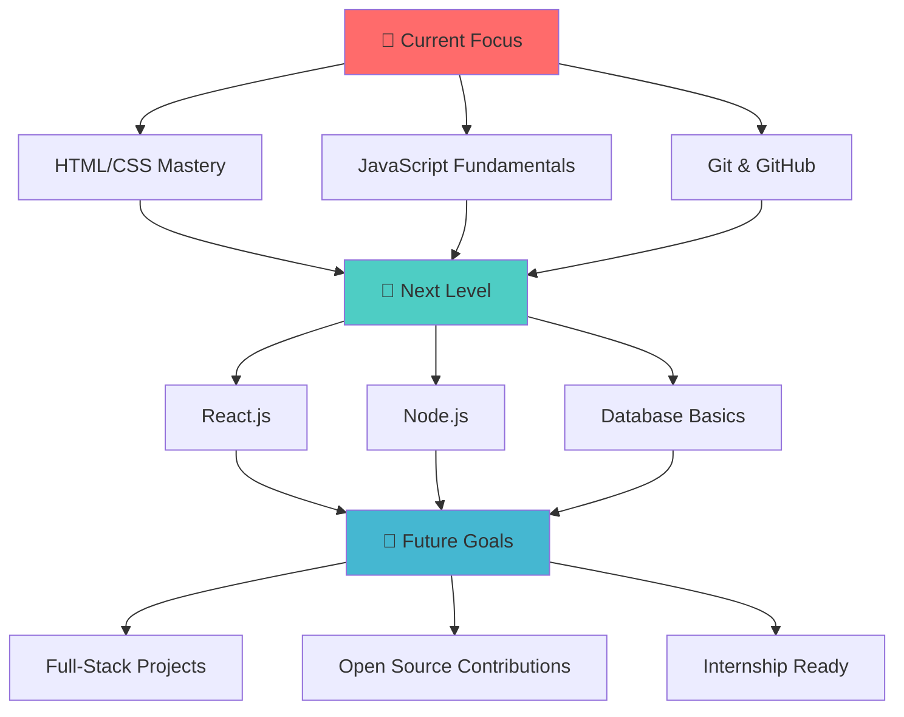

# 
🌟 Hello World! I'm Thang Huynh Duc 🌟

  

  

  

##  About Me

🎓 **Software Engineering Student** at **Academy of Cryptography Techniques (KMA)**

 **Currently working on:** Learning fundamental programming and building my first projects

 **Currently learning:** JavaScript, HTML/CSS, Data Structures & Algorithms

 **Looking to collaborate on:** Student projects and open source contributions

 **Ask me about:** My coding journey, learning resources, student life

 **How to reach me:** [thang.huynhduc.work@gmail.com](mailto:thang.huynhduc.work@gmail.com)

 **Fun fact:** Every expert was once a beginner - I'm writing my story one line of code at a time!

  

##  Technologies & Tools

###  Currently Learning

###  Next on My Learning Path

  

##  GitHub Analytics

  
  

  

  

##  Achievements & Trophies

  

##  Learning Roadmap 2024

##  Current Projects & Learning

| 📚 Learning Topic | 📈 Progress | 🎯 Status |
|------------------|-------------|-----------|
| HTML & CSS |  | 🔥 Active |
| JavaScript ES6+ |  | 📖 Learning |
| Git & GitHub |  | 💪 Practicing |
| Data Structures |  | 🌱 Started |
| React.js |  | 📝 Planning |

##  Connect With Me

  

  

##  Inspirational Quote

  

  

---

  
  
  
  
  
  **"Code is poetry written in logic"** ✨
  
  **Made with ❤️ by [Thang Huynh Duc](https://github.com/thang-huynhduc)**
  
  
  

  

